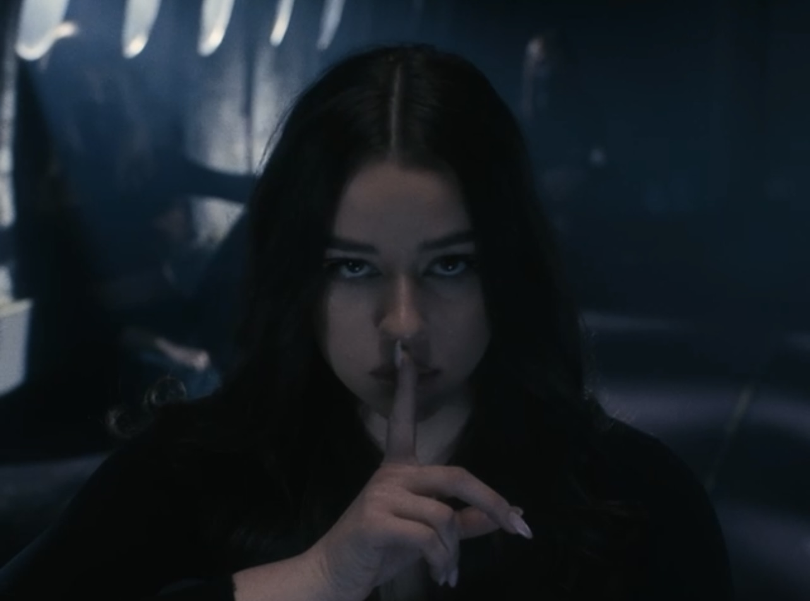

# First Impression

- [About](#about)
- [Projects](#projects)

# About

***Hi!***
***I am Angelika - an artist from Slovakia. But who am I beyond that? Honestly, I don’t know. Not because I don’t have any hobbies or passions, but because there’s so many of them. I am way too many things to pick just one and completely define myself by it.***

I am a graphic designer, but also a singer, songwriter, lyricist and a creative enthusiast in general. I am a student and an intern, but also my own employee relentlessly working on my biggest dreams. I believe, I was given a voice - vocal, visual, as well as verbal, and my main job in this life is to use it. I love expressing myself, my ideas and visions, especially through art, because it gives me unlimited freedom and acceptance. I love to connect with people through my art and offer them something to make their lives a bit more bearable. A bit less painful and lonely. So I guess I could say, I like being bold, loud and out there.

But I also love silence. I may not seem like I’m the best at it, but I love to just sit and listen. Observe and then analyze. Dig deep into the deepest depths of a matter. Contemplate on the most entangled thoughts that’ve ever crossed my mind. I am fascinated by everything that transcends us. Psychology, astrology, numerology, all the spiritual beliefs and theories. I love to pick it all apart in my own little 3D reality. 

So who am I beyond a Slovak artist? I guess you could say ‘a walking contrast’🌗

# Projects

## United Islands of Prague

## My Fatherland

## [ALYA - MESTO](https://www.youtube.com/watch?v=Lm1JRj3MLOo)

