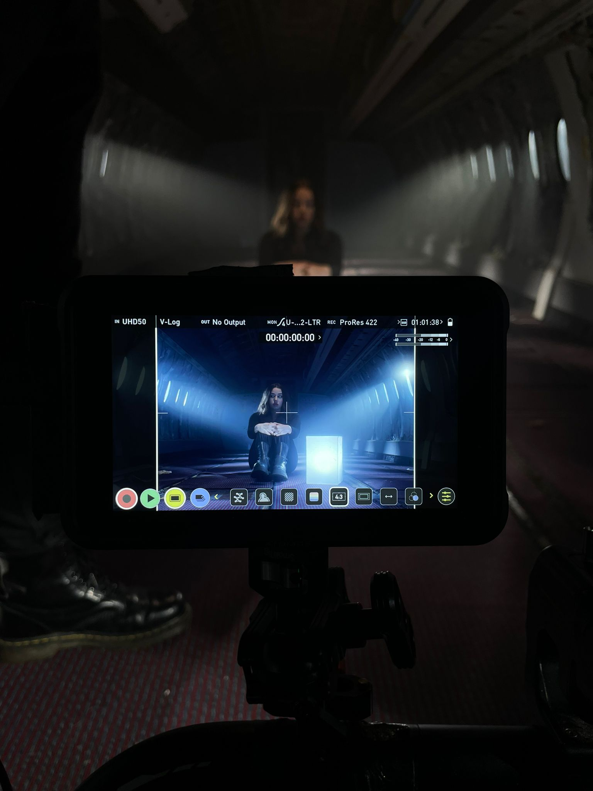
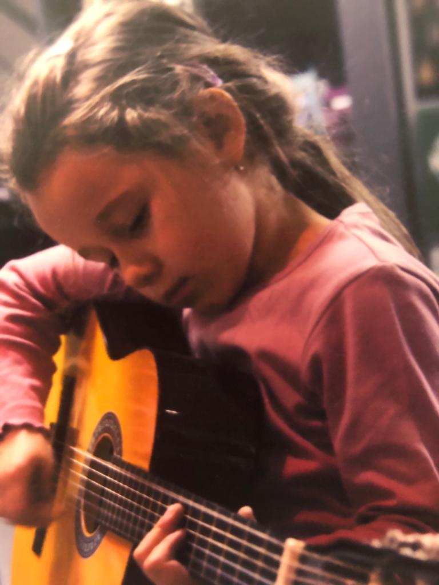
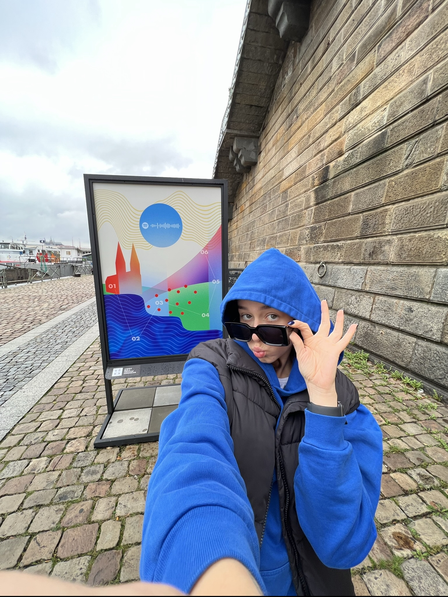

- [Home](index.md)
- [My work](work.md)
- [My writing](writing.md)

# About me

## You get the best of both worlds!⭐️

Just like Hannah Montana, most of the time I feel as if I'm living two lives at once as well. It might be a bit overwhelming at times, but I wouldn't have it any other way. When I am in Prague, I am usually a graphic design student. But as soon as I cross the borders with Slovakia, Angelika switches into Alya and in Bratislava I am a singer and songwriter, who would breathe music instead of air if it was possible.

## My music journey

I am convinced that my passion for music began even before I was born. Both of my parents are musicians and my mother sung at their live performances until the very last month of her pregnancy. Therefore, as soon as I became aware of my existance, all I wanted was for my dad to sit me down on top of our super old piano, play my favorite song, which I would sing from the top of my lungs on and on and on.

I believe, I was given a voice - vocal, visual, as well as verbal, and my main job in this life is to use it. I love expressing myself, especially through music and its lyrics, because it gives me unlimited freedom and compassion. I love to connect with people through my art and offer them something to make our lives a bit more bearable. A bit less painful and lonely. So I guess I could say, I like being loud, bold and out there⚡️

## How I got to graphic design

I loved music my whole life, but as I got older I felt the urge to find another artistic medium to help me, furthermore, embody my thoughts, feelings and ideas. And so I discovered graphic design. When COVID hit Europe and it seemed almost impossible to do music beyond the four walls of my room, I started experiencing with Adobe programs and I instantly knew that grafic design would be the perfect tool to complement my musical ambtions. 

Ever since, fusing graphic design with music became one of my biggest hobbies. I have always loved the idea of Gesamtkunstwerk and I feel that by developing as a graphic designer, I am slowly, but surely getting closer to it.

