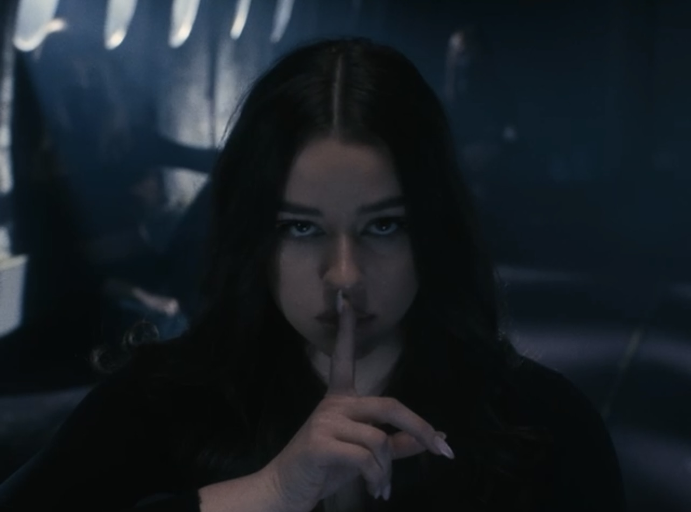

- [Home](index.md)
- [About me](about.md)
- [Writing](writing/index.md)

# My work

### My work as ALYA

## [ALYA - MESTO](https://www.youtube.com/watch?v=Lm1JRj3MLOo)

Since February 2023, I started releasing my music publicly below the music and production label ILLUMINATE and it so far, it has been an absolute dream come true. MESTO (The City) was the third song I've released with my first ever featuring by a Slovak rapper. The song's lyrics is about having that special someone by your side even when the lights turn off and the city quiets down. The music video is based on atmospheric and abstract shots which support the song's mood and idea, rather than following a specific storyline.

## [ALYA - NECHCEM BYŤ SAMA](https://www.youtube.com/watch?v=u2kaFBS9OBA)

NECHCEM BYŤ SAMA (I Don't Want To Be Alone) is the latest song that I have released so far. In its lyrics, I admit that I might be developing some tiny little feelings for someone and maybe, I don't want to spend my days only in my own company anymore. Compared to the music video for MESTO, which was shot in late May of 2023, I thought I might freeze to death during this one🥶 but I think it was worth the pain in the end.

## [ALYA & YAEL - NEBO](https://www.youtube.com/watch?v=GhS_bUm9L7Y)

Speaking of pain, filming a music video for NEBO (Heaven), numbers-wise my most successful song so far, was not heavenly at all. It was probably the shortest, yet the physically hardest music video I have ever filmed. Have you ever went on a 3 hours long, super steep hike with all the filming equipment, a wedding dress (even though you're not getting married on that hike), a full face of make up and your hair perfectly done (minus a hair tie though🥲) in a 35 degrees Celsius summer heatwave kind of weather? I have! But hey! People seem to like the song, as well as the video, so I think it is all okay. Even when me and the guy I wrote this love song about are currently practicing no contact. That's life I guess🌞

### My work as Angelika Kollmannová

## United Islands of Prague

United Islands of Prague is a music festival which takes place on Prague's river islands every spring. The festival's ideology is based on values such as diversity, freedom and inclusion. Therefore, when designing its visual identity in December 2022, I opted for fluid, dynamic and organic shapes and bright colors. The logo itself is, however, very simple and clean, only based on a black and white typography, representing fusion between the structuredness of the city and the colorfulness and individality of its inhabitants.

## My Fatherland

I love merging graphic design with music, and this passion of mine gave birth to a purely graphic print I designed for a Czech shop Bohéma in the spring of 2022. It is a poster inspired by the set of six symphonic compositions by Bedřich Smetana called My Fatherland (Má Vlast). Each of these compositions is symbolically and also numerically represented in the design. The poster also contains a Spotify scan code, hidden in a blue circle at the top of the poster, providing the print, inspired by a classical artwork with a modern, interactive feature.

