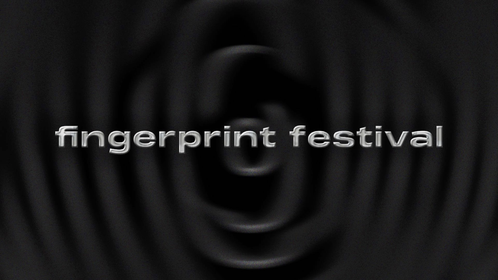
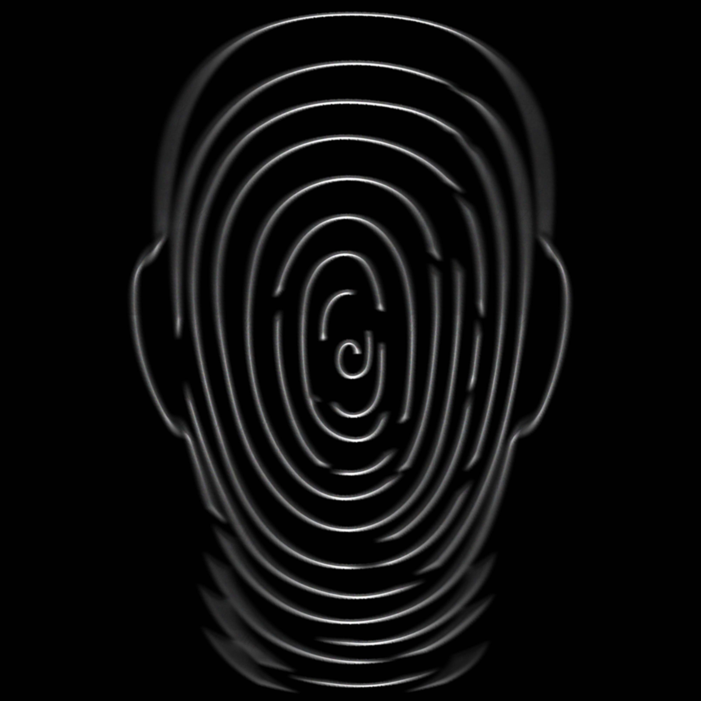

- [Home](index.md)
- [About me](about.md)
- [My writing](writing.md)

# My work

### My work as [ALYA](https://open.spotify.com/artist/39OL7XofJjgzDzCSP3AdhB?si=2xl-aiSFSxOEBojqMMxy4g)

## [ALYA - MESTO](https://www.youtube.com/watch?v=Lm1JRj3MLOo)

_Still from the music video for Mesto, June 2023._

Since February 2023, I started releasing my music publicly under the music and production label ILLUMINATE and so far, it has been an absolute dream come true. Mesto (The City) was the third song I've released with my first ever featuring by a Slovak rapper. The song's lyrics is about having that special someone by your side even when the lights turn off and the city quiets down. The music video is based on atmospheric and abstract shots which support the song's mood and idea, rather than following a specific storyline.

## [ALYA - NECHCEM BYŤ SAMA](https://www.youtube.com/watch?v=u2kaFBS9OBA)

_Still from the music video for Nechcem Byť Sama, December 2023._

Nechcem Byť Sama (I Don't Want To Be Alone) is the latest song that I have released so far. In its lyrics, I admit that I might be developing some tiny little feelings for someone and maybe, I don't want to spend my days only in my own company anymore. Compared to the music video for MESTO, which was shot in late May of 2023, I thought I might freeze to death during this one. 🥶 After all, I think it was worth the pain.

## [ALYA & YAEL - NEBO](https://www.youtube.com/watch?v=GhS_bUm9L7Y)

_Behind the scenes photo from the Nebo music video shoot, September 2023._

Speaking of pain, filming a music video for Nebo (Heaven), my most successful song so far numbers-wise, was not heavenly at all. It was probably the shortest, yet physically the hardest music video I have ever filmed. Have you ever went on a 3 hours long, super steep hike with all the filming equipment, a wedding dress (even though you're not getting married on that hike), a full face of make up and your hair perfectly done in a 35 degrees Celsius summer heatwave kind of weather? I have! But hey! People seem to like the song, as well as the video, so I think it is all okay. Even when me and the guy I wrote this love song about are currently practicing no contact. But that's life I guess. 🌞

### My work as Angelika Kollmannová

## United Islands of Prague

_Visual identity design for the United Islands music festival - key visual, December 2022._

United Islands of Prague is a music festival which takes place on Prague's river islands every spring. The festival's ideology is based on values such as diversity, freedom and inclusion. Therefore, when designing its visual identity, I opted for fluid, dynamic and organic shapes and bright colors. The logo itself is, however, very simple and clean, only based on a black and white typography, representing fusion between the structuredness of the city and the colorfulness and individality of its inhabitants.

## My Fatherland

_Graphic print design for Bohéma, April 2022._

I love merging graphic design with music, and this passion of mine gave birth to a purely graphic print I designed for a Czech shop Bohéma in the spring of 2022. It is a poster inspired by the set of six symphonic compositions by Bedřich Smetana called My Fatherland (Má Vlast). Each of these compositions is symbolically and also numerically represented in the design. The poster also contains a Spotify scan code, hidden in a blue circle at the top of the poster, providing the print, inspired by a classical artwork with a modern, interactive feature.

## Fingerprint Festival

 

_Visual identity design for the Fingerprint Festival - key visual, September, 2023._

_Fingerprint Festival's symbol, September 2023._

Fingerprint Festival is a fictional event for which I not only created its logo, visual identity and communication, but also the concept and ideology, which the whole event is based on. The festival offers a unique space, where artists and creatives such as musicians, producers, dancers, writers and digital designers can not only enjoy and get inspired from the performances at the festival, but they may also use this time and place for networking, taking part in different workshops and classes, developing new skills or improving in their talents and artistic hobbies with the helping hand of the industry's professionals. The festival's symbol comprises of an actual fingerprint which represents a silhouette of a human head.

