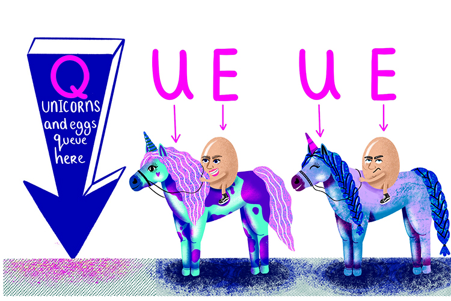

- [Home](index.md)
- [About me](about.md)
- [My work](work.md)

# My writing
### Queue - One Word Essay

_by Angelika Kollmannová, November 2023_

English spelling and pronunciation can be quite tricky sometimes. I was born and raised in Slovakia, Slovak language is my mother tongue and my brain is probably wired a bit differently compared to a English native speaker’s brain. Over the years, I have noticed a few peculiar examples of English grammar, which I genuinely find very much inexplicable. 

For example the word ‘Wednesday’. Who felt the unrelenting need to add a D and an extra E to the formula? Why is there a B in the word ‘dumb’ and who needs the first R in ‘February’? In Slovak language, a word’s pronunciation is parallel to its spelling. Due to this reason, English grammar is oftentimes a bit hard for me to comprehend. 

Yet there is one word in particular, which amazes me every single time I come across it - the one and only ‘queue’. Something that could have been so simple and sweet. Until somebody decided to add four extra letters to the mix. Sure, ‘ueue’ might sound fun on its own, but what exactly is its importance in this case? 

How can even a word like ‘queue’ exist in today’s society? In a society, where we face challenges such as the growth of the human population or exhaustion of material resources and base our lifestyles on the pillars of reduction and minimalism. How is it possible that a word like ‘queue’ exists in this very moment? Who allowed it to take up so much space. All for nothing! Because out of all the five letters, only ones audible. In spoken language, the other four letters remain silent. 

My question is - what is their function? Do they only exist to waste space in written documents? Or to lower the chances of guessing the correct word when playing hangman? What is their true meaning?

I will never be able to solve this mystery and I will never find out why do silent letters exist. But there is one thing I know for sure. Silent letters will always annoy the living hell out of me. Especially, the so far unrevealed rationale for the spelling of the word ‘queue’. That will haunt me in my mind for the rest of my life.
